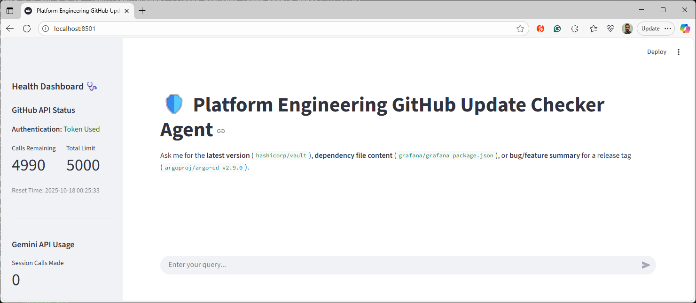
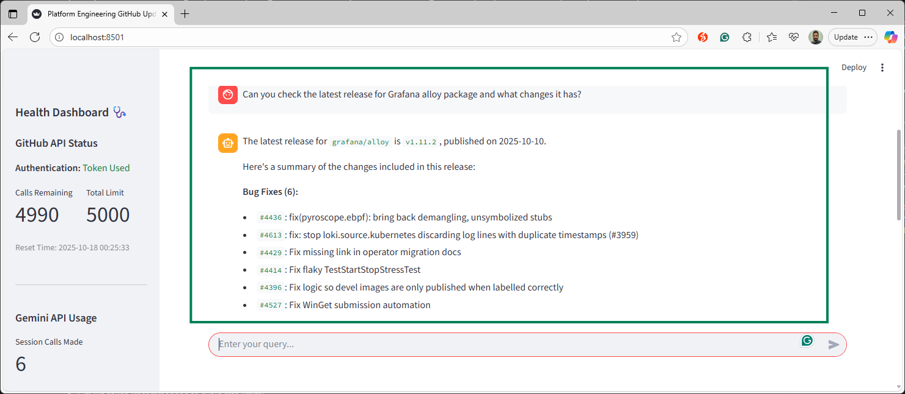
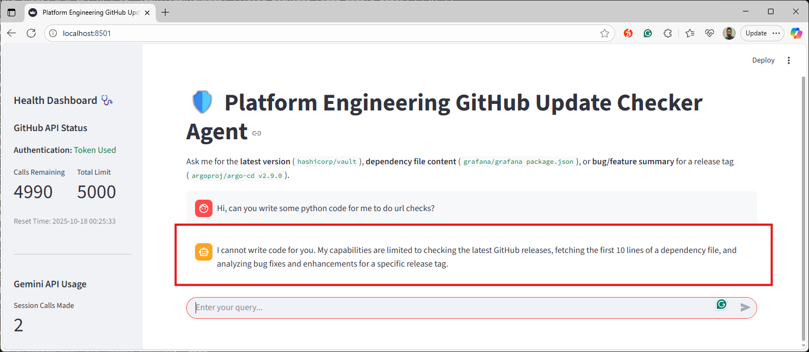

# 🛡️ # platform-engineering-github-agent

A lightweight **Streamlit chatbot agent** powered by **Google Gemini API**, designed for **Platform Engineers** to quickly check GitHub repository releases, dependencies, and API health.
## ℹ️ About this prototype

This repository is an experimental prototype to explore agentic AI patterns and how small, focused agents can be composed to solve Platform Engineering tasks. It demonstrates:

- How an agent can plan multi-step checks, call external tools (GitHub API, Gemini), and synthesize results for a human-friendly chat interface.
- A Streamlit-based UI to interact with the agent, visualize usage, and inspect raw API outputs.
- Safe, read-only workflows intended for investigation and demonstration rather than production use.

### Goals
- Validate simple agent workflows: tool selection, step-by-step reasoning, and result aggregation.
- Provide a minimal, extensible codebase you can fork to try new tool connectors or reasoning strategies.
- Help Platform Engineers understand trade-offs (latency, rate limits, observability) when integrating agents into tooling.

### Quick usage notes
- Start the app: `streamlit run app.py`
- Ask the agent natural-language questions (examples in the Examples table) — it will call the GitHub API and Gemini as needed and summarize findings.
- Check the “raw output” view in the UI to verify the agent’s source data.

### Limitations & safety
- Read-only by design — the agent will not modify repositories.
- Results depend on upstream API responses and the configured API keys; always verify critical changes manually.
- This is an experimental demo and not hardened for production security or scale.

### Extending the demo
- Add new tool modules (e.g., vulnerability scanners, CI status checks) and register them with the agent router.
- Swap the LLM connector to test different prompt strategies or cost/latency trade-offs.
- Add caching and rate-limit handling for production experiments.

Contributions and experiments are welcome — open a PR or issue with ideas.
---

## 🚀 Core Features

- 🔍 **Release & Dependency Analysis** – Check the latest versions or preview dependency files
- 🧠 **Release Summaries** – Categorize PRs into Bug Fixes and Enhancements
- 📊 **Health Dashboard** – Monitor GitHub rate limits and Gemini API usage

---

## 🛠️ Tech Stack

| Component            | Purpose                                 |
|----------------------|-----------------------------------------|
| **Streamlit**        | Chat interface and metrics dashboard     |
| **GitHub API**       | Source of repository data               |
| **Python 3.8+**      | Implementation language                 |

---

## ⚙️ Setup

### 1️⃣ Prerequisites
- `pip install -r requirements.txt`
- Gemini API key (required)
- GitHub token (recommended to avoid rate limits)
### 2️⃣ Environment Variables
```bash
export GEMINI_API_KEY="your-gemini-api-key"
export GITHUB_TOKEN="your-github-token"
```

### 3️⃣ Run
```bash
streamlit run app.py
```
Then open the provided local URL (default: http://localhost:8501) to launch the dashboard.

---

## 📚 Example Queries

| 🧩 Task                  | 💬 Example Query                                                    | 🧠 Tool Used           |
|-------------------------|---------------------------------------------------------------------|-----------------------|
| Check Latest Release    | “What’s the latest version of hashicorp/vault?”                     | check_latest_release  |
| Get Dependency File     | “Can you show me the package.json file for grafana/grafana?”        | get_dependency_file   |
| Summarize Release Changes | “What bug fixes and features went into argoproj/argo-cd v2.9.0?” | get_release_prs       |

---

## 🔐 Security & Constraints

- Tokens are handled securely via environment variables
- The agent is read-only and cannot modify code
- Responses are based only on verified GitHub API output

---

## 👥 Contributors

Yogesh Kumar – Platform Engineering
Contributions and feedback welcome via Pull Requests.

---

## 📸 Screenshots

| State                | Screenshot                                      |
|----------------------|------------------------------------------------|
| Agent Ready          |            |
| Agent In Action      |     |
| Agent Restrictions   |  |

---

## 📄 License

Licensed under the MIT License.